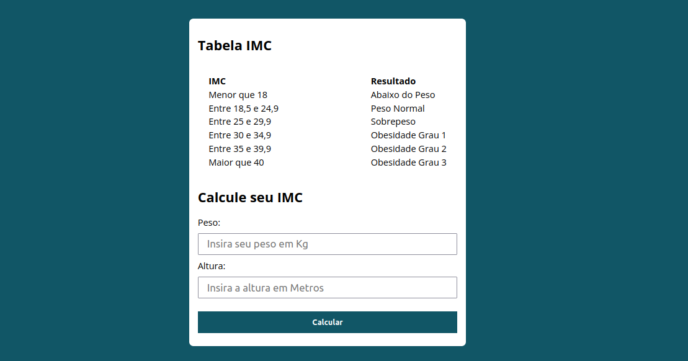

# Calculadora de Índice de Massa Corporal

Linguagens utilizadas: 

- HTML 5
- CSS 3
- Javascript ES6

Recursos:
- Calcula o Índice de massa corporal
- Responsividade
- Javascript ES6 moderno
- possui validador de campos
- segue boas praticas como escopo interno de função para evitar que variáveis conflitem com variáveis no escopo global
